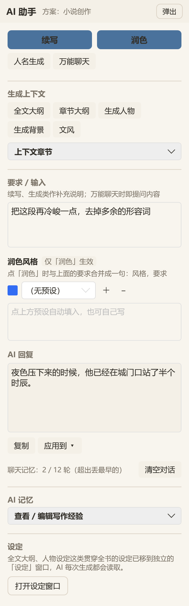

<div align="center">

# AI 写作助手

**面向长篇创作的 Windows 桌面编辑器 —— 本地优先，AI 深度集成**

项目 / 章节 / 设定 / 历史版本的管理，和续写 / 润色 / 大纲 / 命名的 AI 能力，
放在同一个窗口里。让 AI 理解你正在写的那本书，而不是一个孤立的对话框。


</div>

---

## 目录

- [它解决什么问题](#它解决什么问题)
- [主要功能](#主要功能)
- [服务商接入：选一个，填 Key 和模型就能用](#服务商接入选一个填-key-和模型就能用)
- [系统提示词：多方案 + 可自定义](#系统提示词多方案--可自定义)
- [界面速览](#界面速览)
- [技术栈](#技术栈)
- [快速开始](#快速开始)
- [MCP：让 AI 客户端直接读写你的书稿](#mcp让-ai-客户端直接读写你的书稿)
- [配置与数据存放位置](#配置与数据存放位置)
- [项目结构](#项目结构)
- [几条设计说明](#几条设计说明)
- [已知限制](#已知限制)
- [许可证](#许可证)

---

## 它解决什么问题

写作时用通用聊天窗口和 AI 对话，有几个绕不开的麻烦：

| 麻烦 | 这个项目的做法 |
|---|---|
| AI 不知道你在写什么 | 把「设定」「大纲」「人物」「文风」作为**上下文层**注入到每次请求，不用反复粘贴 |
| 每次都要重新交代要求 | 提示词按功能拆成 **13 个可编辑槽位**，一次调好长期生效 |
| 写不同体裁要换一套说法 | **四套预设方案**（小说 / 论文 / 公文 / 通用），一键切换；也可另存为自定义方案 |
| 改坏了回不去 | 项目快照 + **版本历史**，随时恢复到某个版本 |
| 成稿导出格式不对 | 内置 **Word / PDF / TXT** 三种导出，中文排版与生僻字都处理过 |

软件是**本地优先**的：项目、正文、历史版本、写作经验都存在你自己的磁盘上，
只有调用 AI 的那一刻才会把上下文发给你配置的服务商。

---

## 主要功能

### 写作与项目管理

- **项目 / 章节树**：新建、重命名、删除、上移下移；单文件 `.tdxproj` 存整个项目
- **正文编辑**：撤销 / 重做 / 剪切 / 复制 / 粘贴，实时字数统计
- **全书查找替换**（Ctrl+F）：跨章搜索带上下文预览，双击跳到那一处并选中；支持单处替换与
  全书替换。改人名、查伏笔埋在哪几章都靠它
- **自动保存**：编辑中每 60 秒自动存盘，切到别的程序时立即存一次；写盘走「写临时文件 →
  原子替换 → 留 `.bak`」，不会在写一半时留下损坏的项目文件。**落盘在后台线程**——
  50 万字序列化一次要两三百毫秒，放在 UI 线程就是每 60 秒卡一下，而且往往正好卡在打字时
- **写作统计**：状态栏常驻「今日 +N 字 · 连续 N 天」，点开看最近两周的量。统计按项目
  单独记在 `<项目目录>/.stats/`
- **设定窗口**：全文大纲、章节大纲、人物、背景、文风集中在独立窗口维护
- **叙事视角**：一句话声明（如「第三人称限知·跟随主角」），非空即硬约束——AI 续写/润色只写该视角能感知的内容，防止「切头」进别人内心
- **角色出场统计**：一键扫描全书，统计每个角色的出场章次、总次数与连续缺席（纯本地文本扫描，不花 token）
- **设定集**：把上述设定自动统合成一本资料书（12 章骨架，含「伏笔与线索登记」），AI 补全空章，可导出 Word / PDF / TXT
- **一致性审稿**：对照设定集检查某章正文与设定的矛盾，输出问题清单（只读分析，不改写正文）
- **参考文献库**：论文写作用的文献管理（BibTeX 导入 + 论文方案下 OpenAlex / Semantic Scholar 在线检索），AI 引用 [n] 只出自库内、不编造
- **版本历史**：每次快照可回滚（`ProjectSnapshotManager`）
- **AI 记忆**：把写作经验沉淀成 `memory.md`，下次调用自动带上

### AI 能力

| 功能 | 说明 |
|---|---|
| **续写** | 基于正文与上下文继续写下去 |
| **润色** | 改写当前章节；可挂多个「润色风格」预设。输出上限按章节长度动态给，撞上限会**拒绝覆盖原文**并把结果留在回复框里 |
| **人名生成** | 按题材与风格生成人名（论文 / 公文方案下对应术语命名、事项名称拟定） |
| **万能聊天** | 直接描述需求，不套模板。**带多轮对话记忆**，AI 记得你上一句说过什么 |
| **生成上下文** | 全文大纲 / 章节大纲 / 人物设定 / 背景设定 / 文风设定，一次生成写入项目 |
| **扩展已有内容** | 在已有大纲 / 设定基础上修改完善，而不是推翻重来 |
| **技能** | 创作手法指令包（黄金三章 / 悬念钩子 / 对白强化…）。AI 面板选一个，命中功能的生成就用该手法（与方案叠加），可在设置页管理 / 导入导出；技能可声明适用方案，随方案切换联动 |
| **AI 审稿** | 一致性检查：对照设定集与五项贯穿设定审当前章正文（带**最近 3 章前情链**做跨章比对），输出**问题清单**在只读窗口展示——只挑矛盾、不改写正文；发现伏笔回收/新埋时单列「伏笔章待更新」提醒同步设定集 |

- 支持 **OpenAI 兼容**与 **Anthropic Messages** 两种协议，流式输出
- **断线自动重试 / 流空闲超时 / 停止时保住已生成内容 / 截断自动接着写 / 空响应拦截** ——
  一个都不少，详见「请求发出去之后」
- **接入 prompt caching**：system 按稳定性分段并打缓存断点，长篇小说项目省下可观的输入 token 与首字延迟
- 内置 **24 家主流服务商的接入参数**（国内 / 国际 / 聚合中转 / 本地部署），
  选一家就自动填好地址、协议、认证头 —— 见下一节
- **模型名向服务商现拉**：「拉取列表」直接查询当前真实可用的模型并缓存，
  不依赖会过期的写死清单
- 推理模型的思考内容会被单独识别，不会混进正文，也不会让界面看着像卡死
- 支持保存**多套 API 配置**（`api_profiles.json`），随时切换服务商 / 模型
- AI 回复可一键「复制」或「应用到」正文指定位置
- AI 面板可**弹出为独立浮窗**，不占编辑区

---

## AI 的记忆分三层，别把它们混为一谈

这三样东西的来源、生命周期、清空方式都不同，界面里也分开放：

| | 是什么 | 存放位置 | 怎么清 |
|---|---|---|---|
| **项目设定** | 大纲 / 人物 / 背景 / 文风 + 「上下文章节」勾选 | 项目文件 `.tdxproj` | 在设定窗口里改 |
| **AI 写作记忆** | AI 自己总结的写作经验与你的偏好，每 5 次交互更新一次 | `<项目目录>/.ai_memory/memory.md` | AI 面板「清空记忆」 |
| **对话记忆** | 「万能聊天」的最近若干轮问答；超出预算时自动压成摘要 | `<项目目录>/.chat/session.json` | AI 面板「清空对话」 |

前两层每一轮请求都会带上（作为 system），第三层只服务「万能聊天」——
续写、润色、生成类都是一次性任务，不带历史对话。

**关于"每次都要重读一遍"。** 大模型 API 是**无状态**的：服务端不保存任何会话，
所谓"连续对话"就是客户端每次请求都把完整历史重发一遍。所以"重发"是协议决定的，
不可避免；真正会出问题的是**压根没带历史** —— 那才是每问一句都开了一个新对话。
本项目的做法是：

- system（身份 + 设定 + 写作记忆 + 勾选的参考章节）每轮都发，且**固定在最前面**，
  这样能命中服务端的 prompt caching，长上下文项目省 token 也省延迟；
- 「万能聊天」带上最近若干轮对话（轮数与总字数都有硬上限兜底，超出丢最早的）；
- 当前章节正文每轮只带**一份**，放在本轮 user 里 —— 历史里不重复堆正文，
  你刚改完的正文立刻生效，也不会在上下文里出现两份互相打架的正文。

### 上下文装不下了怎么办：先省，再压

窗口大小是硬上限，撞上去就是一次 400，整轮白问、还可能把正文写成一行报错。
所以每次发请求之前会先算一遍「这一轮装不装得下」，装不下就按**代价从低到高**依次出手：

| 步骤 | 手段 | 代价 | 丢掉的是什么 |
|---|---|---|---|
| ① | 什么都不做 | — | — |
| ② | **省略较早的 AI 回复**（换成一行占位符） | 本地计算，免费 | 几乎没有 —— 那些回复早就写进章节了 |
| ③ | **把更早的对话交给模型写成摘要** | 一次模型调用 | 细节，但结论与你的硬性要求都会保住 |

机制取自 ZCode（`zai-org/ZCode`）的 compact 体系，口径与几条关键常数照搬，
每个类的注释里都标了出处（`Services/CompactPolicy.cs` / `MicroCompactor.cs` /
`ContextSummarizer.cs` / `ChatContextCompactor.cs`）。落到使用上的几条规则：

- **窗口统一按 200K 算**：不再按模型名去猜窗口大小。现代模型的窗口基本都 ≥200K
  （Claude / o 系 200K，Gemini / GPT-4.1 1M），按猜小的值算阈值只会让压缩**过早触发** ——
  明明还剩大半个窗口就开始丢上下文，白白损失却换不来安全。所以一律取 200K 作下限；
  已知明显更大的模型（Gemini / GPT-4.1 / qwen-long，1M）仍按各自的大窗口算。
  真接上小窗口模型时，改 `Services/ModelContextCatalog.cs` 里的 `AssumedContextWindow`
  一个常量即可（目前未做设置项 —— 按现状用不到）。
- **提前量**：不是顶到天花板才动，而是离阈值还有一段（13K token）就开始 ——
  200K 口径下实际阈值约 183K。阈值分母是「窗口 − 本次请求的输出预留」——
  上下文窗口是**输入输出共享**的，不减掉输出那部分，
  就会出现"还剩一点空间但不够写完回复"的位置才开始压缩。
- **真实用量优先**：判断用服务端报回的 `input_tokens`，本地估算只在还没发过请求的第一轮兜底。
  估算按中文加权（汉字记 2 个「估算字符」、西文记 1 个，统一除以 3），
  不是"字数 ÷ 4"那种英文经验值 —— 对中文小说会低估一倍以上。
- **摘要必须留住硬性要求**：作者的「不要写死主角」这类约束会被**逐字**抄进摘要。
  压缩后信息可以少，但约束不能失真。
- **摘要是滚动的**：再次压缩时会连上一版摘要一起交给模型合并，不会每压一次掉一层信息。
- **熔断**：连续失败 3 次就停手，不在坏掉的链路上反复烧钱；状态栏会说明原因。
- **绝不截断最近的内容**：真装不下时丢的是最旧的细节，不是最新那几轮 —— 那才是要紧的。

AI 面板上会显示当前记忆状态（如 `聊天记忆：摘要 18 轮 + 原文 2 轮 · 约 6.4K / 200K`），
而状态栏那行 `Token: 输入 x + 输出 y = z` 是**服务端报回的**真实用量，两者口径不同、不要混看。

### 请求发出去之后：超时、重试、中断与截断

上下文算好了，不代表请求就能顺利回来。下面这些是**每次调用**都在兜的底 ——
和上面的压缩是两回事：压缩管"装不下"，这里管"送不到、送一半、或送回来是空的"。

| 情况 | 处理 | 为什么必须做 |
|---|---|---|
| 连上了但迟迟不发数据 | **流空闲超时**（默认 90 秒没收到任何字节即判死）后自动重连 | `HttpClient` 的总超时对长文生成不是长就是短：写 3000 字超过一分钟很正常，用默认的 100 秒会**误杀**，设成无限又可能永远挂着 |
| 429 限流 / 5xx / 网络抖动 | **自动重试 4 次**，退避 0.8s → 2s → 5s → 10s；服务端给了 `Retry-After` 就听它的 | 网络抖一下就让整次白等，是最容易被骂的一类问题 |
| 401 / 403 / 404 / 400 | **不重试**，直接把服务端返回的说明摆出来 | 这是配置或请求本身的问题，重试只是烧时间 |
| 点了「停止」 | **保住已经生成的那部分** | 按停止通常是"写到这里够了"，不是要把已写的几千字扔掉。续写会把保留的部分接上去；润色这类**整章覆盖**的任务仍不自动写回，只留在回复框里由你决定 |
| 输出撞到 `max_tokens` | **自动接着写**（最多再续 2 次）后拼接 | 一次截断等于交给你半截正文，对小说基本不可用 |
| 服务端返回 200 但内容为空 | **判定为失败**，不写回 | 内容审查拦截、网关异常、流被静默切断都会这样。若当成功处理，`chapter.Content = ""` 就是**清空整章** |
| 输出预算超出剩余窗口 | 自动收紧 `max_tokens = min(想要的, 窗口 − 估算输入 − 余量)` | 服务端拒的是「输入 **+ 输出** 超窗」，输入侧压缩只解决了前半截 |

重试与空闲超时的提示会走到状态栏（如「连接不稳定，正在重试（1/4）…」）——
不然那十几秒界面完全静止，看起来就是卡死了。

### 省 token：让服务端的缓存真正命中

system 提示词按**会不会跨请求复用**分段发送：

- **身份 + 项目设定（含 AI 记忆）** —— 在同一个项目里基本不变 → 打上
  `cache_control: ephemeral` 缓存断点（Anthropic 协议；OpenAI 兼容协议的缓存是自动按前缀匹配的，不需要标记）
- **勾选章节正文** —— 勾哪几章、正文多长，每次都可能变 → 不打
- **任务说明 + 输出契约** —— 单个只有几百字，通常够不到服务端的最小缓存长度 → 不打

打标记意味着**要写缓存**，而写入按 1.25 倍计价，所以只给真会重复的那一大块打。
命中部分按 0.1 倍计价，状态栏会单独标出来：
`Token: 输入 12000（其中缓存命中 9000）+ 输出 400` —— 不然你只会看到「输入 12000」，
以为每次都这么贵。

⚠ 这一条最容易漏：**光把稳定内容排在前面不会触发缓存**，必须有显式的 `cache_control`。
改动前本项目就是"顺序对了、但一个字都没缓存"。

### 设定集：把设定做成一本可导出的书

大纲、人物、背景、文风散在「设定」窗口里是**给 AI 看的参考资料**；但当你想要一份能
拿给读者、或留给自己做世界档案的**资料书**时，打开「设定集」：

- **自动成书**：首次打开就按模板建好 12 章（作品简介 / 世界观 / 地理势力 / 历史时间线 /
  力量体系 / 人物档案 / 关系网 / 词汇表 / 全文大纲 / 章节大纲 / 文风 / 伏笔与线索登记），
  其中能直接从项目设定抽取的章（简介、世界观、人物、大纲、文风等）**自动填好内容**，
  零成本起步。
- **只补空、不覆盖**：自动成书对已有内容一律不动——你手写或 AI 生成的成果永远不会被覆盖，
  反复打开都是幂等的。
- **AI 补全空章**：地理、历史、关系网这类没有直接来源的章，点「AI 生成 / 完善」让 AI 依据
  项目设定推演补全，推出来的内容会标注「【推断】」，与既有设定冲突的不会写。
- **伏笔与线索登记**：中长篇的埋线台账——伏笔章点「AI 生成 / 完善」，AI 扫描已有章节正文，
  把真实埋下的伏笔整理成「埋设章节｜伏笔内容｜计划回收点｜当前状态」条目；已有内容在其
  基础上完善、不推翻，只登记正文里真实出现的，不推测。
- **制作**：可增改章标题、上下调顺序、勾选哪些章进书，全书书名与副标题可改。
- **导出成书**：Word / PDF / TXT 三格式，封面 + 目录 + 正文，正文支持轻量 Markdown
  （`#` 小节 / `-` 列表 / `**粗体**`）；AI 生成的章会在前言里如实标注「AI 初稿，待审校」。

### 参考文献库：论文写作的引用闭环，零编造

**文献库只在论文模式下存在**：顶部工具栏「模式」下拉切到论文方案（含基于论文的自定义方案）
时「文献库」按钮才出现，切回其它模式按钮即隐藏、已打开的文献库窗口自动关闭。
写论文时打开文献库：

- **文献你来定**：手动添加、从 Zotero / 知网等导出的 `.bib` 文件**导入 BibTeX**
  （自动解析 @article / @inproceedings 等，引用键去重防重复导入），或在
  **论文方案**下用「在线检索」。
- **在线检索（仅论文方案开放）**：一键搜 **OpenAlex** 或 **Semantic Scholar**
  （免费、无需 API Key），按相关性返回标题 / 作者 / 年份 / 来源 / DOI / 摘要，
  勾选后按 DOI 去重导入文献库。检索只是「找候选」，引不引、引哪篇仍由你决定。
- **AI 只引用、不编造**：文献库非空时，所有生成（含万能聊天）自动带上参考文献上下文——
  正文引用标 `[n]` 且**只能引用库内文献**；库里没有的照旧写【需引文献】占位，禁止编造
  文献、DOI、页码。
- **参考文献表一键复制**：按 **GB/T 7714-2015 顺序编码制**生成 `[1]..[n]` 文献表复制到
  剪贴板（类型标识 [J]/[C]/[M]/[D]/[EB/OL]、作者 >3 人截断加「等 / et al.」、页码著录），
  粘进论文即可，编号与正文引用一一对应。
- **文献表自动进导出**：导出 Word / PDF / TXT 时，文献库非空就自动在正文后追加
  「参考文献」章（Word 悬挂缩进 + 五号字，符合文献表排版惯例），无需手动粘贴。
- **论文模式导出**：论文方案下导出自动切换论文版式——摘要页（摘要 + 关键词，
  在项目模型 `PaperAbstract` / `PaperKeywords` 维护）、章节改数字编号（1 / 2 / 3）。
- **BibTeX 导出**：文献库可一键导出为 `.bib`，直接导入 Zotero / JabRef。
- **分项目隔离**：文献库跟着项目文件（`.tdxproj`）走，不同论文互不混库。

### 导出

- **Word**（.docx）：封面 + 目录 + 正文，基于 OpenXml
- **PDF**：基于 QuestPDF，中文字体运行时探测；关闭字形可用性检查，避免生僻字导致整次导出失败
- **TXT**：UTF-8 **带 BOM**，确保记事本等按 ANSI 打开也不会乱码

### 外观与交互

**配色与材质是两个独立维度，可任意组合**（8 套配色 × 6 种材质 = 48 种观感）。
以前两者是绑死的——选「温润纸白」就只能配纸纹，想要毛玻璃得有人再抄一整套。

**8 套配色**：温润纸白 / 墨色玻璃 / 雾绿纸张 / 暖砂纸卷 / 深海蓝 / 晨雾灰 / 赤陶 / 松墨

**6 种材质**：

| 材质 | 观感 |
|---|---|
| **纸纹** | 细颗粒纸面 + 极淡暖光。最像纸的一种，也是默认 |
| **绒面** | 粗块纤维颗粒 + 几乎零反光。布面精装的手感 |
| **毛玻璃** | 细磨砂 + 柔和漫射光 + 中等透光。底色偏冷，没有边缘亮线 |
| **清玻璃** | 几乎无颗粒 + 强反光 + 高透光 + 边缘折射亮线 |
| **液态玻璃** | 斜向流动高光带 + 强边缘光 + 高透光。光泽最强的一种 |
| **纯色** | 完全无质感，没有颗粒也没有光。最省性能也最干净 |

三个维度的跨度是**故意拉开的**——材质之间只差一点点的话，切换时会觉得"好像没换"，
那等于白做了：颗粒 0 → 0.44、柔光 0 → 0.62、透光 0 → 0.45，外加"边缘光"这个强特征
（玻璃边缘的折射亮线，磨砂面没有——它比柔光更抓眼）。

浅色主题下白色柔光打在浅底上几乎看不见，所以玻璃类还会把底色**往冷灰拉一点**：
真实玻璃确实偏冷，这样即使柔光看不出来，颜色本身也在说"这是玻璃"。

对照图（调材质参数时直接看这两张）：`docs/preview/materials-warm.png` /
`docs/preview/materials-dark.png`。

还有**材质强度**滑块（0 = 关掉质感，1 = 默认观感，2 = 加倍）。

- **质感是真的合成进画刷的**，不是叠半透明层：底色 + 颗粒 + 柔光 + 高光用 `DrawingGroup`
  叠成一个 `DrawingBrush`，强度完全可控。靠 alpha 叠层"透出"底纹实测透出率不到 1%，
  会被 8bit 色深直接量化掉（采样标准差精确为 0），等于没做
- **纸纹/绒面走 256px 平铺**（颗粒清晰，大面积看不出重复）；**玻璃类走相对拉伸**——
  大面积渐变一旦平铺就会变成重复的斜条纹。**任何规律性渐变都不能进平铺画布**，
  只有随机噪声才能（这个坑踩过一次，满屏割裂色块）
- **颗粒分三种形态**：细砂（纸纹）/ 2×2 纤维团（绒面，布的手感靠它）/ 微尘（玻璃类）。
  颗粒 alpha 上限给到 0x40 以上——早先给 0x2E 时六种材质肉眼几乎分不出
- 玻璃类材质的**边框会自动变淡**：实色边框会立刻把"玻璃"说破
- **背景图 + 透光材质**是效果最好的组合：面板透出的就是真实画面
- 章节树直接显示每章字数，随打字实时更新
- **大纲视图**（视图 → 大纲）：卡片墙摊开全书结构——每章一张卡，状态点一眼分清
  未写 / 缺梗概 / 已完成；可按状态过滤（"只看还没写的"是卡文时最常用的一个），
  双击直跳那一章，右键改名 / 写梗概 / 上下移动 / 删除。写到几十章之后，
  结构问题（中间空了两章、这几章明显偏短）靠读大纲文本是看不出来的
- 背景图、圆角、配色全部走 **Design Token**，改一处全局生效
- 按钮、菜单、下拉、窗口采用统一的**动效**（只动透明度与变换，不触发布局重算）

> 关于"真毛玻璃"：WPF 没有实时背景模糊，真亚克力要靠 DWM 的
> `SetWindowCompositionAttribute`，代价是开启 `AllowsTransparency`——那会让整个窗口走
> 分层渲染路径，长时间码字时性能损失肉眼可见。所以这里做的是视觉模拟：
> 靠颗粒 + 大面积柔光 + 半透光还原观感，配背景图时最接近真玻璃。

---

## 服务商接入：选一个，填 Key 和模型就能用

接一家新的模型服务，过去要查文档确认「地址到底填哪个」「Key 放哪个请求头」「system 能不能塞进 messages」——
每一项填错都只会得到一个 401 或 400，看不出是哪一步出的问题。这里把这些都预置好了：

**选中服务商 → 地址、协议、认证方式、常用模型全部自动填好 → 只剩 API Key 要你粘。**


内置 24 家，按下拉分组排列：

| 分组 | 服务商 |
|---|---|
| **国内主流** | DeepSeek、月之暗面 Kimi、智谱 GLM、阿里通义千问、火山方舟·豆包、腾讯混元、百度文心、MiniMax、阶跃星辰、零一万物 Yi、硅基流动、小米 Mimo |
| **国际主流** | OpenAI、Claude（Anthropic）、Google Gemini、xAI Grok、Mistral、Groq |
| **聚合中转** | OpenRouter、自建中转（One API / New API 等） |
| **本地部署** | Ollama、LM Studio、vLLM / 自建推理服务 |
| **自定义** | 其它任何 OpenAI 兼容或 Anthropic 兼容服务 |

每次切换服务商，界面上的参数速览会实时告诉你**这一家实际上会怎么发请求**：

```
国内主流 · 协议：OpenAI 兼容（/v1/chat/completions，system 走 messages[0]）
认证：Authorization: Bearer（自动）
```

点右侧「获取 API Key」直达对应厂商的控制台。

### 模型名：向服务商现拉，不靠内置的写死清单

模型名是唯一**不能**预置的东西。各家的版本号后缀（`-20250929` 这类日期、`v4-flash` 这类代号）
改得比程序发版快得多，任何写死在代码里的清单都会过期，变成一串"填上去就 404"的死字符串。

所以模型名做成两步：

1. 点「**拉取列表**」——直接向该服务商查询当前真实可用的模型，结果**落盘缓存**
   （`model_cache.json`），下次打开不用再拉；
2. 从右侧「可用型号」下拉里挑一个，或直接手写。

下拉里的内容按来源分三档，界面会明说是哪一档：

| 来源 | 界面提示 | 说明 |
|---|---|---|
| **本次拉取** | 已拉取 N 个对话模型 | 最准，来自服务商自己 |
| **上次缓存** | 缓存 N 个对话模型 · 拉取于 … | 不用联网也能有真型号 |
| **内置参考表** | 内置参考型号，可能已过期 —— 建议点「拉取列表」 | 只是离线兜底，别当成全部 |

细节上还有几处是刻意的：

- 拉到的清单里 embedding / 语音 / 图片这类模型**默认折叠**（点「显示其余 N 个」摊开），
  写小说不需要它们；带 `models/` 前缀的（Google 原生接口）会自动剥掉，否则请求会 404。
- 拉取失败会给出**可操作的原因**，而不是一个状态码：`401` 指向 Key 本身、`403` 建议直接手填、
  `404` 说明该服务商没有标准列表接口、返回 HTML 说明被网关挡住了 —— 并且都会回显实际请求的地址。
- 「测试连接」成功后会**顺手把清单也拉了**，省得你再点一次。
- 如果测试连接报的错像是在说"模型不存在"，提示会直接把你引到「拉取列表」。

### 三个容易踩空的地方，这里都替你处理了

| 坑 | 处理方式 |
|---|---|
| **认证头各不相同** | 内置三种风格：`Authorization: Bearer`（多数）、`x-api-key` + `anthropic-version`（Anthropic 官方）、`api-key`（小米 Mimo）。也可在「认证方式」里手工覆盖，应对要求特殊的中转服务 |
| **system 消息位置不同** | OpenAI 兼容协议放在 `messages[0]`，Anthropic 协议必须放**顶层 `system` 字段** —— 塞进 `messages` 会被 400 拒绝。协议由服务商预设决定，调用方不用关心 |
| **模型名大小写敏感** | 硅基流动的 `deepseek-ai/DeepSeek-V3`、MiniMax 的 `MiniMax-Text-01` 都区分大小写，界面不会做任何大小写转换（早期版本会强制转小写，那两个服务商直接 404 —— 这是个已修的真实 bug） |

模型列表接口的地址**从对话地址推导**（`…/v1/chat/completions` → `…/v1/models`，`…/v1/messages` → `…/v1/models`，
智谱那种 `/api/paas/v4/...` 的非标准路径同样成立），所以你把地址换成自家中转后，拉取依然打在中转上。
推不出来时（比如只填了主机名）才回落到服务商的显式声明。

**协议判定规则**：选了已知服务商就听它的；只有选「自定义」时才按地址形状推断
（含 `/messages` 当 Anthropic，含 `/completions` 当 OpenAI 兼容）。
如果你把预设的地址换成了自家的中转地址、而它和所选服务商的协议对不上，
界面会在速览里给出**显式警告**，而不是悄悄按错的协议发出去。

多套配置可以并存 —— 例如「DeepSeek 便宜档」和「Claude 精修档」各存一套，右下角随时切。

---

## 系统提示词：多方案 + 可自定义

这是这个项目在「AI 写作工具」里比较特别的一块。


**分层结构**——提示词不是一大坨，而是按职责切开：

| 层 | 内容 | 何时使用 |
|---|---|---|
| ① 身份层 | 写作助手的人设与准则 | 所有 AI 功能共用 |
| ② 上下文层 | 你项目里的设定、大纲、人物、文风、勾选的相关章节 | 随请求动态组装 |
| ③ 任务层 | 每个功能各自的一段任务说明（共 10 个） | 按点击的功能挑一段 |
| ④ 输出契约 | 创作类输出要求 / 结构化输出要求 | 决定 AI 用什么形式回答 |

**四套内置方案**，覆盖不同体裁：

| 方案 | 定位 |
|---|---|
| 小说创作 | 以叙事、人物与文笔为核心，产出可直接入稿的正文 |
| 学术论文 | 强调论据可核查、**不编造文献与数据**、结论不外推 |
| 公文公告 | 规范体例、一文一事、未定信息一律留占位符 |
| 通用写作 | 不限体裁的兜底方案，也可作自定义方案的起点 |

**每个槽位都可以改**。设置里可以逐条编辑、单项恢复默认、整批恢复，也可以：

- **另存为副本** —— 复制某套方案改出自己的版本
- **重命名 / 删除** —— 管理自定义方案
- 切方案、编辑、保存的每一步都支持取消回滚

**在 AI 面板直接切换**。面板头部就是方案下拉，不必进设置页；切换时**技能一起切**——每个方案
记住自己上次的技能，切走再切回来还是它。技能本身可声明「适用方案」（如创作手法只属于小说方案），
论文 / 公文方案下不会冒出「黄金三章」。

自定义方案会记录它**基于哪套内置方案**，所以你没改过的条目将来仍会跟着内置文本一起改进 ——
只存你真正改过的差异，不必整份复制。

> 界面语言、方案内容都面向中文写作场景。

---

## 界面速览

暗色主题（墨色玻璃），AI 面板可弹出为独立浮窗：


AI 面板。底部那行「聊天记忆：n / 12 轮」就是「万能聊天」的上下文 ——
轮数看得见，才知道 AI 到底还记不记得前面说过什么：



---

## 技术栈

| 项目 | 版本 / 说明 |
|---|---|
| 运行时 | .NET 10（`net10.0-windows`） |
| 界面 | WPF（`UseWPF`，`WinExe`） |
| 控件库 | [HandyControl](https://github.com/HandyOrg/HandyControl) 3.5.1 |
| Word 导出 | DocumentFormat.OpenXml 3.5.1 |
| PDF 导出 | [QuestPDF](https://www.questpdf.com/) 2024.12.3（社区许可） |
| 架构 | 纯事件处理式，**无 MVVM**、无第三方 DI / 日志框架 |

---

## 快速开始

### 环境要求

- **Windows 10 / 11**
- **.NET SDK 10**（构建）或 **.NET Desktop Runtime 10**（仅运行）
- 一个可用的 AI 服务：OpenAI 兼容接口 或 Anthropic

### 构建与运行

```bash
git clone https://github.com/zhou2228653446/DDD_WRITING_HELPER.git
cd DDD_WRITING_HELPER

dotnet build 编辑器/编辑器.csproj -c Release
dotnet run   --project 编辑器/编辑器.csproj
```

也可以直接用 Visual Studio 打开根目录的 `编辑器.slnx`。

> 依赖包版本较新，首次还原需要能访问 NuGet。

### 一键发布单文件 exe

不想装 .NET 运行时的机器上也能跑——双击仓库根目录的 **`deploy.bat`**，完成后得到
`dist\编辑器.exe`（约 80MB，自含 .NET 运行时与 SkiaSharp / QuestPDF 原生库，
拷到任何 Windows 10/11 x64 机器直接双击运行）。首次启动需解包原生库，会慢几秒，属正常现象。

命令行等价写法：

```bash
dotnet publish 编辑器/编辑器.csproj -c Release -p:EnableSingleFilePublish=true -o dist
```

> 退出软件时会弹一次「支持作者」窗口——项目免费开源，去 GitHub 点个 Star 就是最大的支持；
> 勾选「下次退出时不再显示」后就不会再打扰你。

## MCP：让 AI 客户端直接读写你的书稿

软件自带一个 **MCP 服务器**（`编辑器.Mcp`（exe 名 `TdxClaw.Mcp`）），配好之后 Antigravity / Claude Desktop /
Cursor / WorkBuddy / Cline 这类 AI 客户端就能直接打开你的 `.tdxproj`、读稿、改稿、导出，不用你在界面里点。

**一键安装**：双击根目录 **`install-mcp.bat`**——它自动检测本机装了哪些客户端
（Antigravity / Claude Desktop / Cursor / WorkBuddy / Cline / VS Code / Codex / Continue），
把配置**合并**进去（原有的其它 MCP 服务器不受影响，写入前自动备份）。逐家配置文件位置的
对照表在 `docs/mcp-clients/README.md`，也可以手动复制对应片段。**装完要重启客户端。**

**配置**：把 `docs/mcp-config-example.json` 里的 `mcpServers` 一节复制进客户端的 MCP
配置文件，`command` 改成你本机 `dist\mcp\TdxClaw.Mcp.exe` 的路径（JSON 里反斜杠写两个）。
`deploy.bat` 会把它和主程序一起发布出来。

**28 个工具**，分六类：

| 类别 | 工具 |
|---|---|
| 找项目 · 看进度 | `project_list`（扫目录找 .tdxproj）、`project_open`、`project_create`（新书自动带设定集 12 章骨架；同名文件拒绝覆盖）、**`project_status`**（一次拿到进度画像 + 下一步建议） |
| 读 | `chapters_list`、`chapter_read`、`chapter_search`（全文搜词，查伏笔/矛盾）、`settings_get`、`settings_book_get`（设定集 12 章）、`characters_stats`（谁多久没出场了）、`characters_list`、`memory_get`、`snapshot_list` |
| 写正文 | `chapter_write`（replace 覆盖 / append 追加）、`chapter_create`、`chapter_rename`、`chapter_delete`、`chapter_reorder`、`chapter_summary_set`（写章节梗概） |
| 写设定 | `settings_set`、`settings_book_set`、`character_upsert`（建/改人物卡）、`character_delete`、`memory_set`（沉淀作者偏好） |
| 产出 | `project_export`（docx / pdf / txt，论文版式传 `paperMode`）、**`ai_write`** |
| 诊断 · 回滚 | `ai_config_check`（服务商/模型/Key 状态 + 可选真连通探测；**绝不输出 Key 本身**）、`snapshot_restore` |

设计取向是**让 agent 能独立完成整本书**：凡是界面里能做、MCP 里做不到的操作都补齐了——
用户说一句「这两章合并」「刚才那次改坏了撤回」，agent 得真能做，而不是回一句"我做不了"。

**资源（resources）**：打开项目后，章节、五项设定、设定集各章都以 `tdx://` 资源暴露
（`tdx://chapter/3`、`tdx://settings/full_outline`、`tdx://settings-book/foreshadow`）。
支持资源的客户端（Antigravity、Cline 等）可以在对话里直接 @ 引用整章，省掉先 list 再 read 一轮往返。

**`ai_write` 是重点**：它调的不是"一个裸模型"，而是**本软件调好的那套 AI**——当前生效的
提示词方案（小说/论文/公文）+ 五项贯穿设定 + 设定集 + 叙事视角硬约束 + AI 写作记忆 +
参考文献库 + 技能，和你在界面里点按钮完全同源。

任务（`task`）分两组：

| | 任务 | 说明 |
|---|---|---|
| **写正文** | `continue` 续写 / `polish` 润色 / `expand` 扩写 / `review` 一致性审稿 / `name` 起名 / `chat` 自由问答 | 针对某一章，需传 `number` |
| **从零建书** | `outline` 全文大纲 / `chapter_outline` 章节大纲 / `character` 人物设定 / `background` 背景设定 / `write_style` 文风 / `setting_book` 补设定集 | 已有内容时自动改成"在原有基础上完善"而非重写 |

`skill` 可指定手法（传 `none` 表示不用）。默认只返回文本；显式传 `writeBack=true` 才落盘——
正文类写章节（续写/扩写默认追加、润色默认替换），设定类写对应设定字段，都可用
`writeMode` 指定，同样受防覆盖保护。每次写入前自动存快照。

**长任务会沿途推进度**：客户端在请求里带 `_meta.progressToken` 时，`ai_write` 会持续发
`notifications/progress`（阶段性提示 + 已生成 token 数）——生成几千字要几十秒，
全程黑屏和卡死没有区别。

**两条安全设计**：

- **防止覆盖你的稿子**：MCP 是独立进程，和编辑器界面各有一份内存。写盘前会比对项目文件的
  修改时间+长度，一旦发现磁盘上的项目已被别的实例改过，就拒绝写入并提示你先关掉界面里的
  项目重新打开——把最致命的"静默覆盖"变成明确报错。
- **写正文默认不自动**：`ai_write` 只生成；`writeBack=true` 是 agent 的显式动作，且照样过防覆盖检查。

**排障**：客户端吞 stderr 看不到日志时，在配置里加
`"env": { "TDX_MCP_LOG": "C:\\临时\\tdxclaw-mcp.log" }` 让服务器把日志落盘。

开发时可用 `TdxClaw.Mcp.exe --selftest` 跑一遍协议自检（59 项断言，覆盖分帧、通知不回、
错误码、落盘、冲突防护、写前快照、章节管理、快照回滚、人物卡、进度回报、资源读写、
建项目、Key 不泄露）。

### 首次配置

1. 启动后会弹出欢迎窗口，按提示新建或打开一个项目
2. 菜单 **AI 助手 → API 设置 → 表单编辑**：
   - 在「AI 服务商」下拉里选一家（24 家内置，地址与协议会自动填好）
   - 粘上 **API Key**（点右侧「获取 API Key」可直达厂商控制台）
   - 点 **「拉取列表」** 取到该服务商当前真实可用的模型名，从右侧下拉里挑一个
     （清单会缓存，下次不用再拉；也可以直接手写模型名）—— 到这一步就能用了
   - 点「测试连接」会连真实接口发一次最小请求，成功时回显实际使用的协议与认证方式，
     并顺手把模型清单也拉回来
   - 需要多套配置就点「+ 新建」，各存一份互不影响
3. 切到 **系统提示词** 页，按用途选一套方案（小说 / 论文 / 公文 / 通用），需要时逐条改
4. 回到主界面，用 **视图 → 设定窗口** 填好大纲 / 人物 / 背景 / 文风，AI 生成时就会自动带上

---

## 配置与数据存放位置

**全局配置**（所有项目共用）：`%AppData%\TdxClaw\`

| 文件 | 内容 |
|---|---|
| `settings.json` | 上次打开的项目等基础设置 |
| `api_profiles.json` | 多套 API 配置。`Provider` 存服务商标识（如 `deepseek` / `anthropic`），旧配置里的显示名（`DeepSeek` / `Claude`）同样能识别。这个文件在设置页有「JSON 编辑」页，可以直接手改 |
| `model_cache.json` | 「拉取列表」查到的真实模型清单，按「服务商@主机:端口」分组缓存。单独一个文件是为了不把几百个模型名塞进你要手改的 `api_profiles.json` |
| `appearance.json` | 配色（`PresetName`）、材质（`MaterialName`）、材质强度、背景图 |
| `system_prompts.json` | 你改过的提示词（**只存与内置不同的条目**，所以内置文本后续改进时会自动跟随） |
| `polish_presets.json` | 润色风格预设 |
| `skills.json` | 自定义技能（只存自定义；内置技能写死在代码里，随版本升级） |

**项目数据**（跟着项目走，放在项目文件所在目录下）：

| 目录 | 内容 |
|---|---|
| `.ai_memory/` | 写作经验（`memory.md`） |
| `.snapshots/` | 历史版本与索引 |
| `.chat/` | AI 对话记录（`ai_log.md`） |
| `.stats/` | 写作统计（每日净增字数，供「今日字数 / 连续天数」用） |

项目文件保存时会在同目录留一份 `<项目名>.tdxproj.bak`（上一版）。写盘走「写 `.tmp` → 原子
替换」，所以正常退出不需要它；真遇到新版本有问题时，把 `.bak` 改回 `.tdxproj` 即可。

项目文件本身是单个 `.tdxproj`（JSON）。上面这些目录以及项目文件都已在 `.gitignore` 里忽略，
不会被误提交到版本库。

---

## 项目结构

```
编辑器.slnx                     解决方案
编辑器/
├─ 编辑器.csproj
├─ App.xaml / App.xaml.cs       应用入口、全局资源合并
├─ MainWindow.xaml(.cs)         主窗口：菜单、章节树、编辑区、导出、AI 调度
├─ FindReplaceWindow.xaml(.cs)  全书查找替换（Ctrl+F，跨章 + 跳转 + 快照保护）
├─ WritingStatsWindow.xaml(.cs) 写作统计：今日字数 / 连续天数 / 最近两周
├─ OutlineWindow.xaml(.cs)      大纲视图：卡片墙 + 状态过滤 + 跳转编辑
├─ AiPanelControl.xaml(.cs)     AI 面板（可停靠 / 可弹出）
├─ FloatingAiWindow.xaml(.cs)   浮动 AI 窗口
├─ SettingsWindow.xaml(.cs)     设定窗口：大纲 / 人物 / 背景 / 文风
├─ SettingsBookWindow.xaml(.cs) 设定集窗口：自动成书 / AI 补全 / 导出成书
├─ ReviewResultWindow.xaml(.cs) 一致性审稿报告窗口：只读问题清单
├─ LiteratureWindow.xaml(.cs)   参考文献库窗口：BibTeX 导入 / 编辑 / 文献表复制
├─ ApiSettingsWindow.xaml(.cs)  AI 设置：表单 / JSON / 系统提示词
├─ AppearanceSettingsWindow    外观设置
├─ PathSettingsWindow          路径设置
├─ NovelScaleDialog / InputDialog / WelcomeDialog
├─ Models/                      NovelProject、AppearanceConfig、PathsConfig
├─ Themes/
│  └─ Tokens.xaml               Design Token：颜色 / 字号 / 圆角 / 间距 / 动效时长
└─ Services/
   ├─ IApiService / OpenAIService / AnthropicService   两种协议的实现
   ├─ StreamingApiServiceBase                          超时/重试/取消保留/续写/预算（两协议共用）
   ├─ ApiProviders                                     24 家服务商接入参数 + 协议/认证判定
   ├─ ModelCatalog / ModelCacheStore                   拉取真实模型清单 + 缓存
   ├─ AiPrompts / PromptPresets / SystemPromptStore    提示词分层与多方案
   ├─ TokenEstimator / ModelContextCatalog             上下文体积估算 + 模型窗口表
   ├─ CompactPolicy / MicroCompactor                   压缩阈值决策 + 本地省略旧回复
   ├─ ContextSummarizer / ChatContextCompactor         摘要生成 + 预算编排
   ├─ ThemeTokens / AppearanceManager / Motion         配色 × 材质 → Design Token、动效
   ├─ WordExportService / PdfExportService / TxtExportService
   ├─ SettingsBookTemplates / SettingsBookExportService  设定集：模板成书 + 三格式导出
   ├─ BibtexParser                                      BibTeX 解析（花括号嵌套容错）
   ├─ LiteratureSearchService                           在线文献检索（OpenAlex / Semantic Scholar，免 Key）
   ├─ NovelSkills                                       技能包：内置/自定义/导入导出/任务命中
   ├─ AiMemoryManager / ChatSessionStore / ChatLogger / ProjectSnapshotManager
   ├─ WritingStatsService                             每日字数与连续天数（按项目统计）
   └─ ApiProfileManager
```

MCP 服务器是独立工程，**不重写任何业务逻辑**，全部 ProjectReference 复用上面的 `Services/`：

```
编辑器.Mcp/
├─ Program.cs       入口（--selftest 跑协议自检）
├─ McpServer.cs     JSON-RPC 2.0 + stdio 主循环 + 16 个工具的 schema
├─ NovelTools.cs    读写 / 检索 / 导出 + Session（含写前冲突检测）
├─ AiTools.cs       ai_write：复用 AiPrompts 与两个 Service，与界面同源
└─ SelfTest.cs      内置自检（59 项断言）
```

---

## 几条设计说明

**为什么没有 MVVM。** 这是个单人维护的桌面工具，窗口数量有限、数据流简单。
纯事件处理省掉了绑定层与状态同步的心智负担，逻辑集中在 `MainWindow.xaml.cs`。
代价是主窗口代码较长 —— 这是有意识的取舍，不是欠债。

**外观为什么拆成配色 + 材质。** 原来 `ThemePreset` 把颜色和质感绑在一起，改一个颜色
要同时改材质参数，想让某套配色配毛玻璃就得复制一整套预设。现在 `ColorScheme` 只描述颜色、
`Material` 只描述质感（颗粒 / 柔光 / 透光 / 高光），两者自由组合 —— 8 × 6 = 48 种观感，
新增一套配色只是加一条数据。

**质感为什么合成进画刷而不是叠半透明层。** 靠多层 alpha 叠加来"透出"底纹，实测透出率被
压到 1% 以下，会被 8bit 色深直接量化掉（采样标准差精确为 0），等于没做。正确做法是用
`DrawingGroup` 把底色、颗粒、柔光、高光叠成一个 `DrawingBrush` —— 强度完全可控，
各区域质地也一致。

**平铺 vs 拉伸。** 纸纹/绒面用 256px 平铺（颗粒清晰，大面积看不出重复）；玻璃类用
`RelativeToBoundingBox` 相对拉伸，因为大面积渐变一旦平铺就会变成重复的斜条纹。
代价是颗粒会被一起拉大，所以玻璃类材质的颗粒都很弱——本来也不靠它。

**颜色全部收敛到 Design Token。** 运行时把当前配色+材质写到应用级资源字典的**顶层**，
因此一处生效、全局包含浮动窗口一起变。所有颜色引用使用 `DynamicResource`
（而非 `StaticResource`）以保证热切换。同时必须覆盖 HandyControl 的皮肤键，
否则夜间模式会出现「面板变深、内容区惨白」的割裂。

**提示词的键与方案解耦。** 代码只认槽位键（如 `Task.Continue`），具体文本由「当前方案 + 覆写」
决定。好处是新增方案不需要改任何调用点，而自定义方案只记录差异、能跟随内置改进。

**协议与认证由服务商预设决定，调用方不关心。** `ApiProviders` 把一家服务商的
「地址 / 协议 / 认证头 / 常用模型 / 申请入口」收在一处，`MainWindow` 只问「给我哪个实现」。
判定次序是：用户显式覆盖 > 服务商预设声明 > 地址形状推断（仅对「自定义」生效）。

**模型清单只信服务商自己。** 内置的型号表仅作离线兜底 —— 各家改版本号的速度比程序发版快，
写死的名字迟早会失效。所以 `ModelCatalog` 从对话地址推导出模型列表接口、现场拉取，
`ModelCacheStore` 把结果按「服务商@主机:端口」缓存下来。
拉取失败时给出的是「哪一步错了 + 该怎么办」（Key 无效 / 没有该接口 / 被网关挡住），
而不是一个裸状态码 —— 这类失败用户只有看到原因才能自己解决。
三者矛盾时在界面上给出显式警告 —— 静默按错的协议发出去，用户只会看到一个没头没尾的 400。

**失败绝不允许写回正文。** 两个 Service 把失败与取消也包成 `AiResult` 返回（不抛异常），
所以"结果非 null"从来就不等于成功。所有把 `result.Text` 写进章节正文或设定的地方，
都必须先过 `IsUsable` 这一道 —— 否则一次 401 就能把整章正文换成一行
"API调用失败: …"，还得靠版本历史去捞。同一条纪律也管住了"被截断的结果"：
`finish_reason = length` 时**拒绝覆盖原文**，结果留在回复框里由用户决定。

**质感不是叠透明度。** 面板 alpha 只透出很少的底纹，再乘纸纹自身的 alpha，有效值会被 8 位色深
量化掉（实测标准差精确为 0，等于没做）。正确做法是把主题纯色与程序生成的颗粒**合成进同一个画刷**。
材质系统只是把这个思路推广到六种质感上，并额外支持半透光与高光层。

---

## 测试

```bash
dotnet test 编辑器.Tests/编辑器.Tests.csproj     # 43 项单元测试
./编辑器.Mcp/bin/Debug/net10.0-windows/TdxClaw.Mcp.exe --selftest   # 59 项 MCP 协议自检
```

单元测试覆盖**不需要 GUI 的那部分**——恰恰是最容易出静默错误的地方：

| 覆盖 | 为什么值得测 |
|---|---|
| 查找替换的字符串逻辑（`TextSearch`） | 命中不重叠、替换前复核索引是否失效、上下文截取越界 |
| 写作统计（`WritingStatsService`） | 跨天结算、连续天数从昨天数、删改不倒扣——错了不报错，只是数字悄悄不对 |
| 章节管理（改名 / 删除 / 重排 / 梗概） | 删章后章号必须连续，章号是唯一定位依据，留空洞就找不到章 |
| 快照与原子写 | 快照必须存的是**改之前**的状态；写盘不能留下半截 JSON |

`TextSearch` 是为了可测才从 `FindReplaceWindow` 抽出来的——那段逻辑原本和 WPF 绑死。

界面部分（布局、材质观感）目前只能渲染成图看：临时起一个 WPF 控制台项目，用
`RenderTargetBitmap` 把画刷渲染成 PNG。这条路抓到过两个肉眼看代码发现不了的问题
（规律性渐变被放进 256px 平铺画布、液态玻璃高光在浅色主题下过冲）。

## 已知限制

- 仅支持 Windows（WPF）
- 界面改动仍需**渲染成图肉眼确认**（WPF 无头自动化生态薄弱）；材质调参可直接对照
  `docs/preview/` 下的对比图
- 多语言界面尚未抽象，目前为中文
- 云同步、协作、插件系统均未实现

---

## 许可证

本仓库暂未指定开源许可证。在添加 `LICENSE` 之前，默认保留所有权利。

如需开源，可考虑 MIT / Apache-2.0；如需限制商用，可考虑 AGPL-3.0 或自定义许可。

> 界面截图取自 2026-09 的版本。
