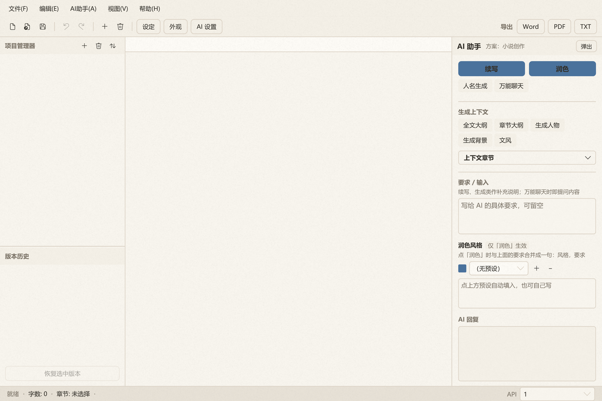
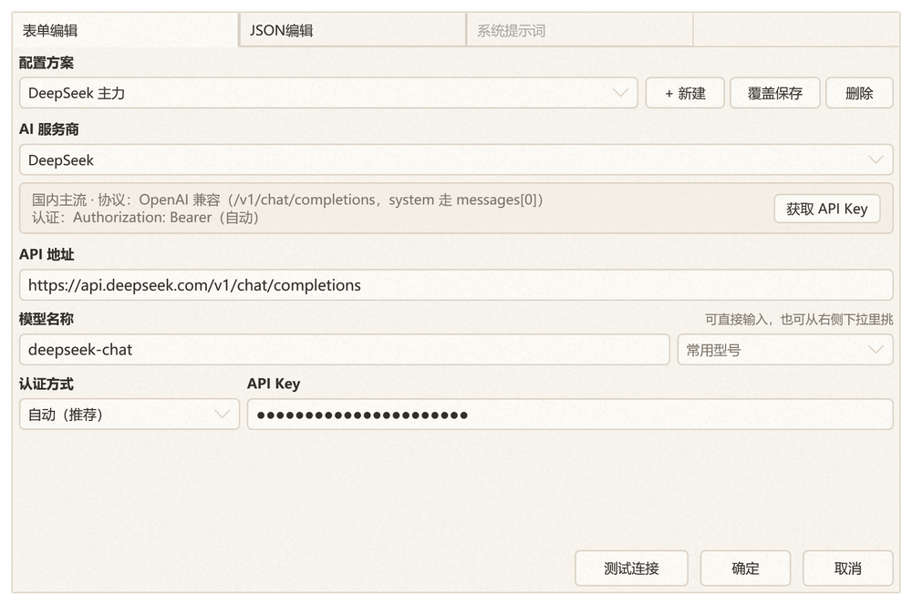
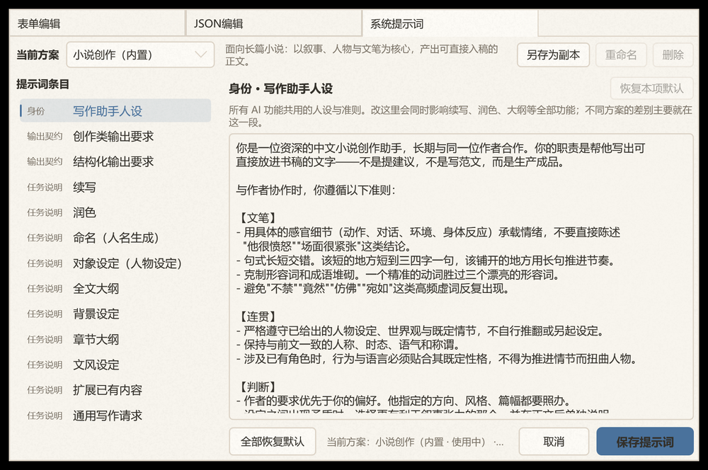
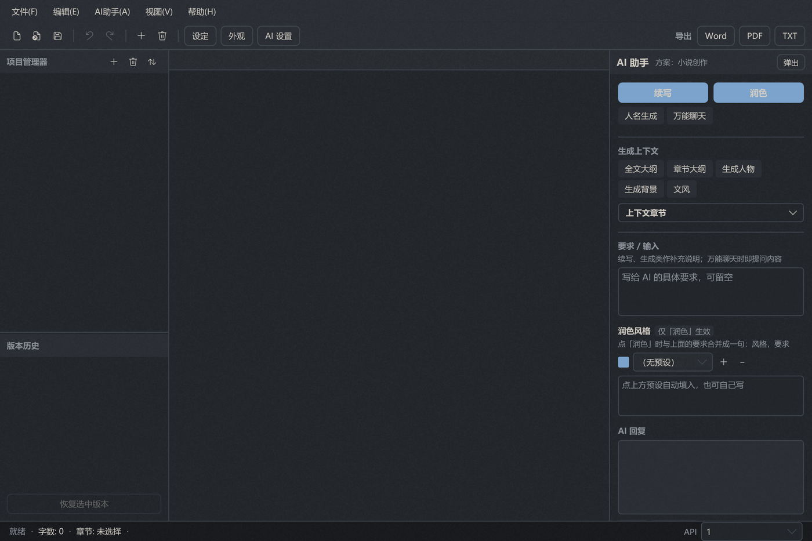

<div align="center">

# AI 写作助手

**面向长篇创作的 Windows 桌面编辑器 —— 本地优先，AI 深度集成**

项目 / 章节 / 设定 / 历史版本的管理，和续写 / 润色 / 大纲 / 命名的 AI 能力，
放在同一个窗口里。让 AI 理解你正在写的那本书，而不是一个孤立的对话框。




</div>

---

## 目录

- [它解决什么问题](#它解决什么问题)
- [主要功能](#主要功能)
- [服务商接入：选一个，填 Key 和模型就能用](#服务商接入选一个填-key-和模型就能用)
- [系统提示词：多方案 + 可自定义](#系统提示词多方案--可自定义)
- [界面速览](#界面速览)
- [技术栈](#技术栈)
- [快速开始](#快速开始)
- [配置与数据存放位置](#配置与数据存放位置)
- [项目结构](#项目结构)
- [几条设计说明](#几条设计说明)
- [已知限制](#已知限制)
- [许可证](#许可证)

---

## 它解决什么问题

写作时用通用聊天窗口和 AI 对话，有几个绕不开的麻烦：

| 麻烦 | 这个项目的做法 |
|---|---|
| AI 不知道你在写什么 | 把「设定」「大纲」「人物」「文风」作为**上下文层**注入到每次请求，不用反复粘贴 |
| 每次都要重新交代要求 | 提示词按功能拆成 **13 个可编辑槽位**，一次调好长期生效 |
| 写不同体裁要换一套说法 | **四套预设方案**（小说 / 论文 / 公文 / 通用），一键切换；也可另存为自定义方案 |
| 改坏了回不去 | 项目快照 + **版本历史**，随时恢复到某个版本 |
| 成稿导出格式不对 | 内置 **Word / PDF / TXT** 三种导出，中文排版与生僻字都处理过 |

软件是**本地优先**的：项目、正文、历史版本、写作经验都存在你自己的磁盘上，
只有调用 AI 的那一刻才会把上下文发给你配置的服务商。

---

## 主要功能

### 写作与项目管理

- **项目 / 章节树**：新建、重命名、删除、上移下移；单文件 `.tdxproj` 存整个项目
- **正文编辑**：撤销 / 重做 / 剪切 / 复制 / 粘贴，实时字数统计
- **设定窗口**：全文大纲、章节大纲、人物、背景、文风集中在独立窗口维护
- **版本历史**：每次快照可回滚（`ProjectSnapshotManager`）
- **AI 记忆**：把写作经验沉淀成 `memory.md`，下次调用自动带上

### AI 能力

| 功能 | 说明 |
|---|---|
| **续写** | 基于正文与上下文继续写下去 |
| **润色** | 改写选中文本；可挂多个「润色风格」预设 |
| **人名生成** | 按题材与风格生成人名（论文 / 公文方案下对应术语命名、事项名称拟定） |
| **万能聊天** | 直接描述需求，不套模板 |
| **生成上下文** | 全文大纲 / 章节大纲 / 人物设定 / 背景设定 / 文风设定，一次生成写入项目 |
| **扩展已有内容** | 在已有大纲 / 设定基础上修改完善，而不是推翻重来 |

- 支持 **OpenAI 兼容**与 **Anthropic Messages** 两种协议，流式输出
- 内置 **24 家主流服务商的接入参数**（国内 / 国际 / 聚合中转 / 本地部署），
  选一家就自动填好地址、协议、认证头与常用模型 —— 见下一节
- 支持保存**多套 API 配置**（`api_profiles.json`），随时切换服务商 / 模型
- AI 回复可一键「复制」或「应用到」正文指定位置
- AI 面板可**弹出为独立浮窗**，不占编辑区

### 导出

- **Word**（.docx）：封面 + 目录 + 正文，基于 OpenXml
- **PDF**：基于 QuestPDF，中文字体运行时探测；关闭字形可用性检查，避免生僻字导致整次导出失败
- **TXT**：UTF-8 **带 BOM**，确保记事本等按 ANSI 打开也不会乱码

### 外观与交互

- **四套内置主题**：温润纸白 / 墨色玻璃 / 雾绿纸张 / 暖砂纸卷，支持热切换
- **纸纹质感**：主题色与程序生成的颗粒合成进同一个画刷，面板 / 编辑区 / 菜单分层设强度
- **背景图**、圆角、配色全部走 **Design Token**，改一处全局生效
- 按钮、菜单、下拉、窗口采用统一的**动效**（只动透明度与变换，不触发布局重算）

---

## 服务商接入：选一个，填 Key 和模型就能用

接一家新的模型服务，过去要查文档确认「地址到底填哪个」「Key 放哪个请求头」「system 能不能塞进 messages」——
每一项填错都只会得到一个 401 或 400，看不出是哪一步出的问题。这里把这些都预置好了：

**选中服务商 → 地址、协议、认证方式、常用模型全部自动填好 → 只剩 API Key 要你粘。**



内置 24 家，按下拉分组排列：

| 分组 | 服务商 |
|---|---|
| **国内主流** | DeepSeek、月之暗面 Kimi、智谱 GLM、阿里通义千问、火山方舟·豆包、腾讯混元、百度文心、MiniMax、阶跃星辰、零一万物 Yi、硅基流动、小米 Mimo |
| **国际主流** | OpenAI、Claude（Anthropic）、Google Gemini、xAI Grok、Mistral、Groq |
| **聚合中转** | OpenRouter、自建中转（One API / New API 等） |
| **本地部署** | Ollama、LM Studio、vLLM / 自建推理服务 |
| **自定义** | 其它任何 OpenAI 兼容或 Anthropic 兼容服务 |

每次切换服务商，界面上的参数速览会实时告诉你**这一家实际上会怎么发请求**：

```
国内主流 · 协议：OpenAI 兼容（/v1/chat/completions，system 走 messages[0]）
认证：Authorization: Bearer（自动）
```

点右侧「获取 API Key」直达对应厂商的控制台。模型名既可以从右侧下拉里挑常用型号，也可以直接手写。

### 三个容易踩空的地方，这里都替你处理了

| 坑 | 处理方式 |
|---|---|
| **认证头各不相同** | 内置三种风格：`Authorization: Bearer`（多数）、`x-api-key` + `anthropic-version`（Anthropic 官方）、`api-key`（小米 Mimo）。也可在「认证方式」里手工覆盖，应对要求特殊的中转服务 |
| **system 消息位置不同** | OpenAI 兼容协议放在 `messages[0]`，Anthropic 协议必须放**顶层 `system` 字段** —— 塞进 `messages` 会被 400 拒绝。协议由服务商预设决定，调用方不用关心 |
| **模型名大小写敏感** | 硅基流动的 `deepseek-ai/DeepSeek-V3`、MiniMax 的 `MiniMax-Text-01` 都区分大小写，界面不会做任何大小写转换（早期版本会强制转小写，那两个服务商直接 404 —— 这是个已修的真实 bug） |

**协议判定规则**：选了已知服务商就听它的；只有选「自定义」时才按地址形状推断
（含 `/messages` 当 Anthropic，含 `/completions` 当 OpenAI 兼容）。
如果你把预设的地址换成了自家的中转地址、而它和所选服务商的协议对不上，
界面会在速览里给出**显式警告**，而不是悄悄按错的协议发出去。

多套配置可以并存 —— 例如「DeepSeek 便宜档」和「Claude 精修档」各存一套，右下角随时切。

---

## 系统提示词：多方案 + 可自定义

这是这个项目在「AI 写作工具」里比较特别的一块。



**分层结构**——提示词不是一大坨，而是按职责切开：

| 层 | 内容 | 何时使用 |
|---|---|---|
| ① 身份层 | 写作助手的人设与准则 | 所有 AI 功能共用 |
| ② 上下文层 | 你项目里的设定、大纲、人物、文风、勾选的相关章节 | 随请求动态组装 |
| ③ 任务层 | 每个功能各自的一段任务说明（共 10 个） | 按点击的功能挑一段 |
| ④ 输出契约 | 创作类输出要求 / 结构化输出要求 | 决定 AI 用什么形式回答 |

**四套内置方案**，覆盖不同体裁：

| 方案 | 定位 |
|---|---|
| 小说创作 | 以叙事、人物与文笔为核心，产出可直接入稿的正文 |
| 学术论文 | 强调论据可核查、**不编造文献与数据**、结论不外推 |
| 公文公告 | 规范体例、一文一事、未定信息一律留占位符 |
| 通用写作 | 不限体裁的兜底方案，也可作自定义方案的起点 |

**每个槽位都可以改**。设置里可以逐条编辑、单项恢复默认、整批恢复，也可以：

- **另存为副本** —— 复制某套方案改出自己的版本
- **重命名 / 删除** —— 管理自定义方案
- 切方案、编辑、保存的每一步都支持取消回滚

自定义方案会记录它**基于哪套内置方案**，所以你没改过的条目将来仍会跟着内置文本一起改进 ——
只存你真正改过的差异，不必整份复制。

> 界面语言、方案内容都面向中文写作场景。

---

## 界面速览

暗色主题（墨色玻璃），AI 面板可弹出为独立浮窗：



---

## 技术栈

| 项目 | 版本 / 说明 |
|---|---|
| 运行时 | .NET 10（`net10.0-windows`） |
| 界面 | WPF（`UseWPF`，`WinExe`） |
| 控件库 | [HandyControl](https://github.com/HandyOrg/HandyControl) 3.5.1 |
| Word 导出 | DocumentFormat.OpenXml 3.5.1 |
| PDF 导出 | [QuestPDF](https://www.questpdf.com/) 2024.12.3（社区许可） |
| 架构 | 纯事件处理式，**无 MVVM**、无第三方 DI / 日志框架 |

---

## 快速开始

### 环境要求

- **Windows 10 / 11**
- **.NET SDK 10**（构建）或 **.NET Desktop Runtime 10**（仅运行）
- 一个可用的 AI 服务：OpenAI 兼容接口 或 Anthropic

### 构建与运行

```bash
git clone https://github.com/zhou2228653446/DDD_WRITING_HELPER.git
cd DDD_WRITING_HELPER

dotnet build 编辑器/编辑器.csproj -c Release
dotnet run   --project 编辑器/编辑器.csproj
```

也可以直接用 Visual Studio 打开根目录的 `编辑器.slnx`。

> 依赖包版本较新，首次还原需要能访问 NuGet。

### 首次配置

1. 启动后会弹出欢迎窗口，按提示新建或打开一个项目
2. 菜单 **AI 助手 → API 设置 → 表单编辑**：
   - 在「AI 服务商」下拉里选一家（24 家内置，地址与协议会自动填好）
   - 粘上 **API Key**（点右侧「获取 API Key」可直达厂商控制台）
   - **模型名**从右侧下拉里挑，或直接手写 —— 到这一步就能用了
   - 点「测试连接」会连真实接口发一次最小请求，成功时回显实际使用的协议与认证方式
   - 需要多套配置就点「+ 新建」，各存一份互不影响
3. 切到 **系统提示词** 页，按用途选一套方案（小说 / 论文 / 公文 / 通用），需要时逐条改
4. 回到主界面，用 **视图 → 设定窗口** 填好大纲 / 人物 / 背景 / 文风，AI 生成时就会自动带上

---

## 配置与数据存放位置

**全局配置**（所有项目共用）：`%AppData%\TdxClaw\`

| 文件 | 内容 |
|---|---|
| `settings.json` | 上次打开的项目等基础设置 |
| `api_profiles.json` | 多套 API 配置。`Provider` 存服务商标识（如 `deepseek` / `anthropic`），旧配置里的显示名（`DeepSeek` / `Claude`）同样能识别 |
| `appearance.json` | 主题预设与背景图 |
| `system_prompts.json` | 你改过的提示词（**只存与内置不同的条目**，所以内置文本后续改进时会自动跟随） |
| `polish_presets.json` | 润色风格预设 |

**项目数据**（跟着项目走，放在项目文件所在目录下）：

| 目录 | 内容 |
|---|---|
| `.ai_memory/` | 写作经验（`memory.md`） |
| `.snapshots/` | 历史版本与索引 |
| `.chat/` | AI 对话记录（`ai_log.md`） |

项目文件本身是单个 `.tdxproj`（JSON）。上面这些目录以及项目文件都已在 `.gitignore` 里忽略，
不会被误提交到版本库。

---

## 项目结构

```
编辑器.slnx                     解决方案
编辑器/
├─ 编辑器.csproj
├─ App.xaml / App.xaml.cs       应用入口、全局资源合并
├─ MainWindow.xaml(.cs)         主窗口：菜单、章节树、编辑区、导出、AI 调度
├─ AiPanelControl.xaml(.cs)     AI 面板（可停靠 / 可弹出）
├─ FloatingAiWindow.xaml(.cs)   浮动 AI 窗口
├─ SettingsWindow.xaml(.cs)     设定窗口：大纲 / 人物 / 背景 / 文风
├─ ApiSettingsWindow.xaml(.cs)  AI 设置：表单 / JSON / 系统提示词
├─ AppearanceSettingsWindow    外观设置
├─ PathSettingsWindow          路径设置
├─ NovelScaleDialog / InputDialog / WelcomeDialog
├─ Models/                      NovelProject、AppearanceConfig、PathsConfig
├─ Themes/
│  └─ Tokens.xaml               Design Token：颜色 / 字号 / 圆角 / 间距 / 动效时长
└─ Services/
   ├─ IApiService / OpenAIService / AnthropicService   两种协议的实现
   ├─ ApiProviders                                     24 家服务商接入参数 + 协议/认证判定
   ├─ AiPrompts / PromptPresets / SystemPromptStore    提示词分层与多方案
   ├─ ThemeTokens / AppearanceManager / Motion         主题与动效
   ├─ WordExportService / PdfExportService / TxtExportService
   ├─ AiMemoryManager / ChatLogger / ProjectSnapshotManager
   └─ ApiProfileManager
```

---

## 几条设计说明

**为什么没有 MVVM。** 这是个单人维护的桌面工具，窗口数量有限、数据流简单。
纯事件处理省掉了绑定层与状态同步的心智负担，逻辑集中在 `MainWindow.xaml.cs`。
代价是主窗口代码较长 —— 这是有意识的取舍，不是欠债。

**主题为什么走 Design Token。** 颜色全部收敛到 `Themes/Tokens.xaml`，运行时把当前预设
写到应用级资源字典的**顶层**，因此一处生效、全局包含浮动窗口一起变。所有颜色引用使用
`DynamicResource`（而非 `StaticResource`）以保证热切换。同时必须覆盖 HandyControl 的皮肤键，
否则夜间模式会出现「面板变深、内容区惨白」的割裂。

**提示词的键与方案解耦。** 代码只认槽位键（如 `Task.Continue`），具体文本由「当前方案 + 覆写」
决定。好处是新增方案不需要改任何调用点，而自定义方案只记录差异、能跟随内置改进。

**协议与认证由服务商预设决定，调用方不关心。** `ApiProviders` 把一家服务商的
「地址 / 协议 / 认证头 / 常用模型 / 申请入口」收在一处，`MainWindow` 只问「给我哪个实现」。
判定次序是：用户显式覆盖 > 服务商预设声明 > 地址形状推断（仅对「自定义」生效）。
三者矛盾时在界面上给出显式警告 —— 静默按错的协议发出去，用户只会看到一个没头没尾的 400。

**质感不是叠透明度。** 面板 alpha 只透出很少的底纹，再乘纸纹自身的 alpha，有效值会被 8 位色深
量化掉（实测标准差精确为 0，等于没做）。正确做法是把主题纯色与程序生成的颗粒**合成进同一个画刷**。

---

## 已知限制

- 仅支持 Windows（WPF）
- 无自动化测试框架；界面改动靠一次性的无头回归脚手架验证（渲染截图 + 断言）
- 多语言界面尚未抽象，目前为中文
- 云同步、协作、插件系统均未实现

---

## 许可证

本仓库暂未指定开源许可证。在添加 `LICENSE` 之前，默认保留所有权利。

如需开源，可考虑 MIT / Apache-2.0；如需限制商用，可考虑 AGPL-3.0 或自定义许可。

> 界面截图取自 2026-09 的版本。
